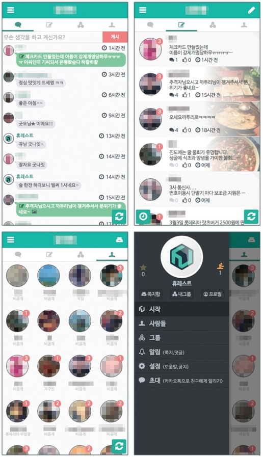

# 기술 경력

웹에서 보기1 : http://bit.ly/2LhIJCu

웹에서 보기2 : https://github.com/hurest/hurest.github.io/blob/master/docs/skill.md

# 사용한 언어, 프레임워크, 라이브러리 및 환경
javascript, typescript, php, delphi, tvjs, tvml

slim framework, express.js, coa.js, mongoose.js, swagger, socket.io

phonegap, cordova, electron, native script

apache, nginx

mysql, mssql, mongodb, redis

grunt, gulp.js, karma, webpack, jasmine, protractor

jquery, underscore.js, require.js, angular.js, angular

pdf.js, fabric.js, canvas

SPA, backbone.js ionic, angular material, jquery mobile, sencha touch

aws, firebase

# 특허
[HTML기반의 웹페이지 원격 제어방법 및 그 제어 시스템](./patent.pdf)

https://hurest.github.io/apps/remote/

# 2018.01 - 2019.06 : 베이크썬, 맘쓰

Typescript 기반의 angular 를 이용하여 SPA 앱 '맘쓰' 개발

모바일 프론트엔드는 angular5, ionic3, fabric.js 를 사용

fabric.js 를 이용하여 디자인된 성장카드를 수정하여 주문하는 서비스를 개발

### 맘쓰 에디터 캡쳐

http://mobile.momth.com

관리자 프론트엔드는 angular5, angular material, sass 로 개발

백엔드는 Typescript 기반의 coa.js, mysql 을 이용하여 api 서버를 구축

swagger ui 를 세팅하여 api 만 별도로 조회 가능하게 세팅 후 aws 에 배포
로컬 개발환경을 도커를 이용하여 세팅

# 2016.09 - 2017.12 : 아이지넷

angular.js + ionic 을 기반으로 마이리얼플랜 모바일 사이트 개발

angular.js + angular material + sass 을 기반으로 마이리얼플랜 데스트탑 사이트 개발

gulp.js 를 이용하여 빌드 및 압축 후 배포

webpack 을 이용하여 로컬 개발 환경 구축

karma 를 이용하여 jasmine 으로 서비스 단위 테스트 진행

protractor 를 이용하여 데스크탑 사이트의 90% 의 기능을 e2e 테스트 진행

### 데스크탑 사이트 스크린샷

http://www.myrealplan.co.kr

# 2015.07 - 2016.04 : KORTVGLOBAL

애플의 TVJS 및 TVML 기반의 UI 프레임워크 단독 개발

애플 TVOS 용 OTT 서비스 앱 개발

아마존 FireTV 용 OTT 서비스 웹앱 개발

# 2014.11 - 2015.04 : 초성

pdf.js 를 이용하여 pdf 로 된 문제집을 업로드 한 뒤,

웹에서 선택하고 잘라서 온라인 문제집으로 변환하는 툴 제작

# 2014.03 - 2014.11 : 엘마정보

델파이로 회계프로그램 개발 (mssql 사용)

SPA로 게시판 프론트엔드 웹 개발 후 webview 에 연결

# 2012.01 - 2014.01 : 휴레스트

require.js, backbone.js, underscore.js, jquery mobile, less 을 이용한 동네 커뮤니티 서비스를 SPA로 개발

백엔드는 mongodb, redis, mongoose.js, express.js 를 이용하여 api 서버 개발

grunt 를 이용하여 빌드 후 phonegap 으로 패키징하여 각각 스토어에 배포

http://www.gjdream.com/v2/news/view.html?news_type=203&uid=449547

### 앱 스크린 샷

### 오프라인 마케팅용 인쇄물 (직접 디자인 함)

# 2011.10 - 2012.01 : 엘마정보

구글 지도 api 를 활용하여 지도 위 감정평가된 정보를 뿌려주는 웹 페이지 개발

# 2010.06 - 2011.12 : 초성 웹 에이전시

javascript 학습을 위해 jQuery 1.0 분석

jQuery, php(슬림 프레임워크 : api 개발 프레임워크), apache 기반의 웹 사이트 제작

Phonegap, jQuery mobile, php, apache 기반의 웹앱 제작

동적계획법을 이용한 사각형 최적화 배치 웹앱 개발

https://hurest.github.io/apps/rect/

# 기타
socket.io, electron 을 이용하여 데스크탑 키보드, 마우스 제어 프로그램 제작

native script, firebase 를 이용하여 안드로이드용 네이티브 앱 제작

sencha touch 을 이용하여 로또번호 생성하는 웹앱 개발

https://hurest.github.io/apps/lotto/

# 간단한 웹앱 리스트
https://hurest.github.io/

